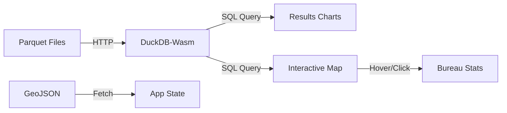

# 📊 Toulouse Municipales 2026 : Observatoire Électoral (Serverless)

Ce projet propose une analyse interactive et hautement performante des résultats des élections municipales de 2026 à Toulouse. 

**[DÉMO LIVE ICI](https://vassal.github.io/toulouse-municipales-2026/)** *(Remplacez par votre lien GitHub Pages)*

---

## 🚀 Vision du Projet

En tant que **Data Scientist / Data Engineer**, l'enjeu était de créer une interface "Zero-Backend" capable de traiter des volumes de données analytiques directement chez l'utilisateur.

### Points Forts Techniques :
- **Architecture Serverless** : Hébergement 100% statique sur GitHub Pages.
- **Moteur OLAP In-Browser** : Utilisation de **DuckDB-Wasm** pour exécuter des requêtes SQL sur des fichiers **Parquet** directement dans le navigateur.
- **Performance Extrême** : Chargement instantané et filtrage fluide grâce à la vectorisation des données.
- **UI/UX Premium** : Interface moderne "Glassmorphic" conçue avec **React** et **Tailwind CSS**.

---

## 🛠️ Stack Technique

-   **Data Engine** : [DuckDB-Wasm](https://duckdb.org/docs/api/wasm/overview) (SQL on Parquet).
-   **Frontend** : React 18, Vite, Framer Motion (Animations).
-   **Styling** : Tailwind CSS (Design System sur mesure).
-   **Cartographie** : Leaflet.js pour une navigation fluide.
-   **Visualisation** : Recharts (Graphiques réactifs).

---

## 🏗️ Architecture des Données



---

## 📝 Installation Locale

```bash
git clone https://github.com/MathAvecH/toulouse-municipales-2026.git
cd webapp
npm install
npm run dev
```

---

## 🌐 Déploiement GitHub Pages

Le projet est configuré pour un déploiement via GitHub Actions.
1. Poussez le code sur la branche `main`.
2. Activez GitHub Pages dans les réglages du repo (Source : GitHub Actions).

---
*Projet réalisé dans le cadre d'une vitrine technique pour démontrer l'alliance entre Data Engineering et Modern Web Development.*
